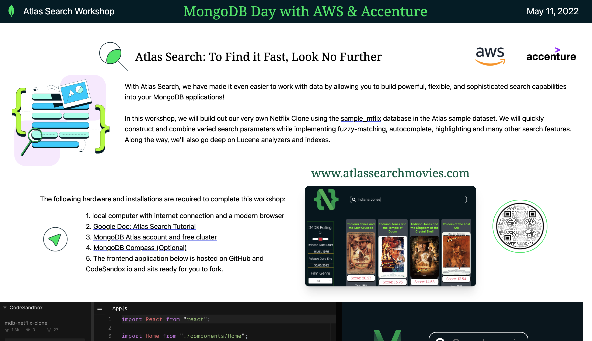
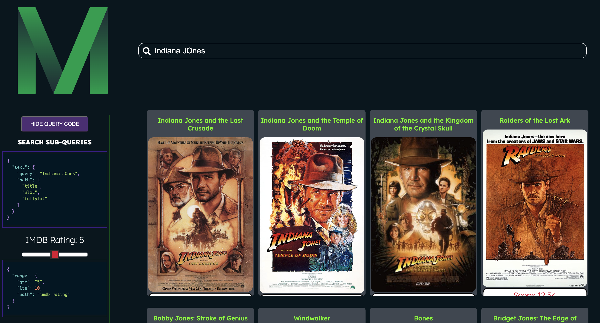
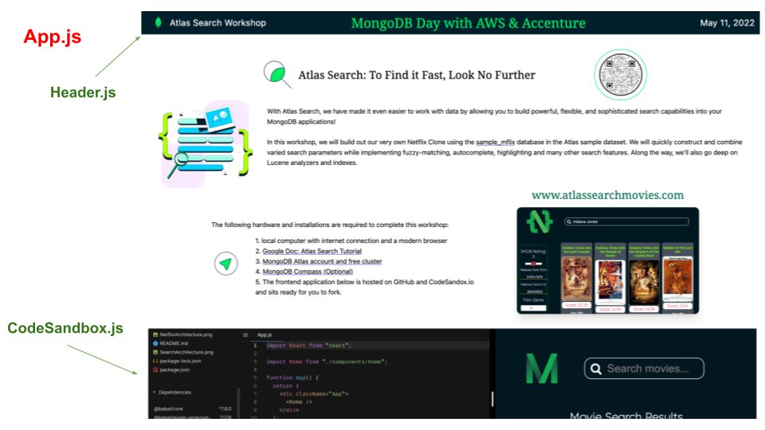
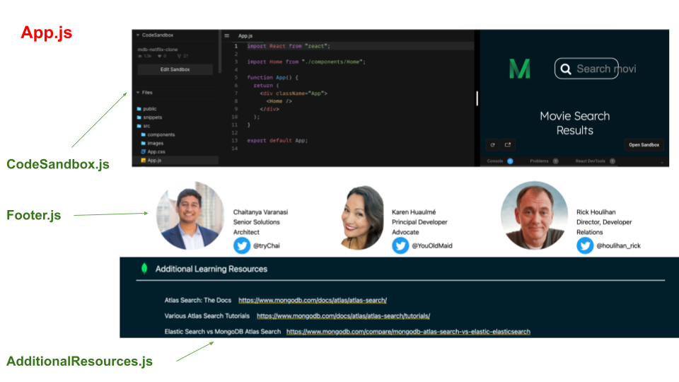

## Atlas Search Workshop

Hello! 👋 Do you want to run an Atlas Search Workshop the easy way? Clone this repo!

https://www.atlassearchworkshop.com

 

 

In the web application, you'll find:

- a Google document with step-by-step instructions
- an embedded CodeSandbox (ready to fork for workshop attendees) with the code for the MongoDB Netflix Clone found at www.atlassearchmovies.com (https://github.com/khuaulme/AtlasSearchWorkshop2022)

 

 

 By building out the MongoDB Netflix Clone application, you'll demonstrate all sorts of  complex, fine-grained full-text searches on your Atlas data.

Current features implemented in this Movie Search Engine demo application include:

- fuzzy matching
- highlighting
- autocomplete
- relevance-based scoring
- custom function scoring

Future Atlas Search features to implement can include:

- [ ] facets
- [ ] synonyms

<h2 align="center"><a href="netflixclone-xwaaq.mongodbstitch.com/">www.atlassearchmovies.com</a></h2>

The movie search application was created using:

- React
- MongoDB Realm for backend HTTPs endpoints and webhooks
- The Atlas sample dataset of sample_mflix.movies

<h3>API Points of Integration</h3>
This application is hosted entirely on Realm and calls 2 API endpoints:
 
 * getProductsEndpoint in the Home.js page on line 24
 * Suggestions_AC_Endpoint, used for autocompleted product names, in the Header.js component on line 17.

<em>Currently this app is not suitable for mobile, but feel free to send a PR.</em> 😊

<h3>Attendee Prerequisites:</h3>

- A MongoDB Atlas account. Get one for free <a href="https://www.mongodb.com/cloud/atlas">here.</a>
- A recent version of Node.js and npm.
- Atlas sample dataset
- (Recommended) <a href="https://www.mongodb.com/try/download/compass">MongoDB Compass - GUI (optional)</a>

This application is hosted entirely by MongoDB Atlas was created using:

- React
- MongoDB Realm for backend HTTPs endpoints and webhooks
- MongoDB's Atlas sample_mflix dataset

<h2>Workshop Attendees Will Need to:</h2>

<ol>
<li> Load data to Atlas cluster:
<ul>
<li>database: <code>sample_mflix</code></li>
<li>collection: <code>movies</code></li>
</ul>
</li>

<li> Create Search indexes.</li>
<li> Create a Realm Application.</li>
<li> Create 2 HTTP Endpoints inside of Realm.</li>
</ol>

<h2>To Build and Run this Search Workshop Application:</h2>

1. Clone the repo.
2. Navigate inside directory.
3. Run <code>npm install</code> .
4. Run <code>npm start </code> .

Runs the app in the development mode.\
Open [http://localhost:3000](http://localhost:3000) to view it in your browser.

<h2>To Customize this Workshop:</h2>
The workshop is all entirely on App.js with the following React components:

Feel free to customize for the event name and details, presenters, resources or even the git repo in the embedded code sandbox.

<h2>Special Thanks </h2>
 

<b>Brian Leonard</b> - In my 4+ years at MongoDB, I have never written a workshop that wasn't ripped off of Brian in some way. #BeLikeBrian  
<b>Snehal Bhatia</b>- That Google doc, tho!

 

Also please join our online <a href="https://developer.mongodb.com/community/forums/">MongoDB Community</a> to interact with our product and engineering teams along with thousands of other MongoDB and Realm users.   Have fun and happy coding!
